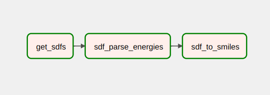

# Drug Design data pipeline
This repo was created to automate data conversion operations. 
It helps to simply convert data from `sdf` format to `smiles`, 
which can be used as an input to NLP models. 

The pipeline was implemented with Apache Airflow [under the Docker].

## Architecture
The current pipeline consists of three steps:
1. Merge all `.sdf` files into a single one
2. Get binding affinity from `.sdf`
3. Convert compounds from `sdf` to smiles, save to `csv` 
(including binding energies)



## How to use
### Prerequisites
To run the pipeline locally, you'll need to install:
* Docker Engine
* Docker Compose

### Step-by-step guide
First, you need to create an appropriate folder structure.
1. create directories called `logs` and `plugins` in the project root
2. create `data` folder with the following structure:


After that, place your compounds inside `sdf/input` folder. Then just open the terminal in the project root and type
```bash
docker-compose build
docker-compose up airflow-init
docker-compose up
```
> Note: you can change the default Airflow login and password inside `docker-compose.yaml` if you want to.

For more detailed guide see: https://www.youtube.com/watch?v=aTaytcxy2Ck

And that's it, you can access `http://localhost:8080/` with Airflow after these steps. 
To run the pipeline, just hit the `run DAG` button :)

## In development
The pipeline will be extended soon. Planned features:
* Docking preparation tool (conversion to `pdbqt`)
* Data post-processing after SMILES generation
